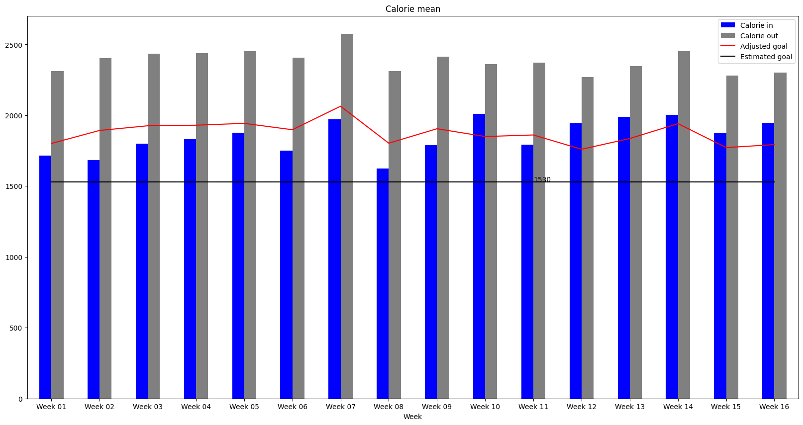
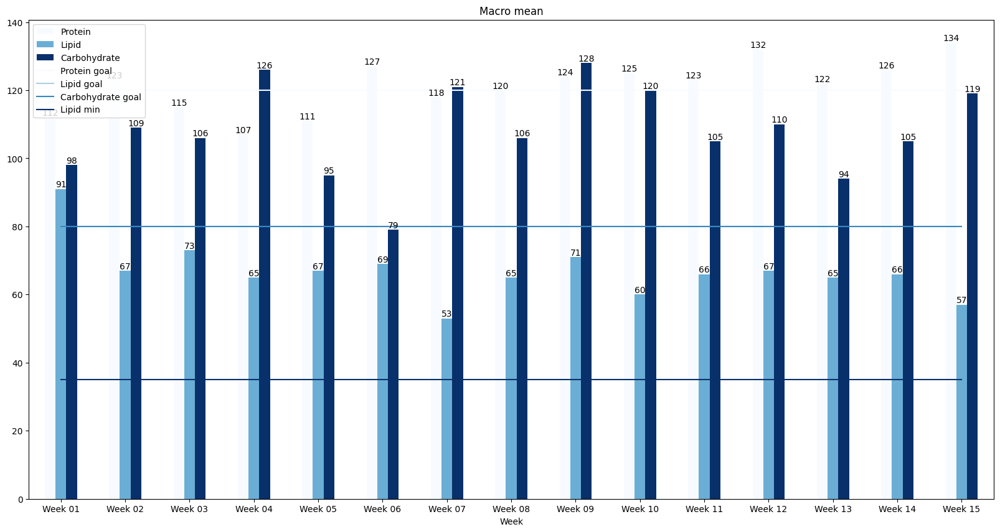
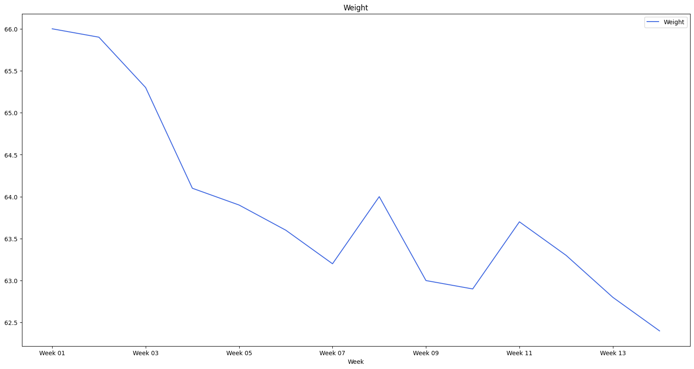

# Nutrition follow up

April 2022 - 3 month feedback

# Initial Parameters

| Weight | Body fat | Activity factor | Deficit | Protein factor | Lipid factor |
|--------|----------|-----------------|---------|----------------|--------------|
| 66kg   | 17%      | 1.35            | 20%     | 2.3 g/kg       | 1.5 g/kg     |

# Parameters from studies

| What         | Calorie     |
|--------------|-------------|
| Protein      | 4 calorie/g |
| Lipid        | 9 calorie/g |
| Carbohydrate | 4 calorie/g |

# Daily goals

| Maintenance  | Deficit     | Goal         | Protein  | Lipid   | Carbohydrate |
|--------------|-------------|--------------|----------|---------|--------------|
| 2095 calorie | 420 calorie | 1675 calorie | 125 g/kg | 80 g/kg | 115 g/kg     |

# Mean calorie per week

# Mean macro per week

# Weight per week

