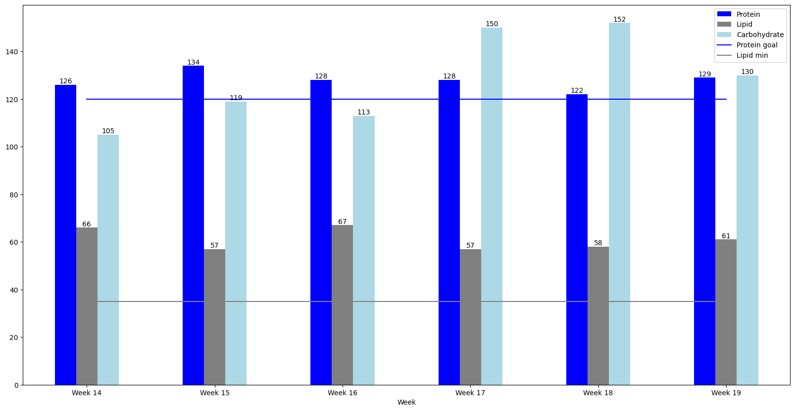

# J'ai compté mes macros

Retour d'expérience

---

# Agenda

- Pourquoi j'ai fait ça
- Mes objectifs
- Le cadre
- Les applications courantes
- Hors cadre
- Poser le cadre
- REX
    - Cut phase (Janvier - Avril)
    - Stabilization phase (Avril - Mai)

---

# Pourquoi j'ai fait ça

## Constat

- Prise de poids entre septembre 2019 et décembre 2020 (+5 kg)
- Pas réussi à perdre du poids en 2021
  - Le sport ne suffit pas
  - Pas envie de faire un "régime"

---

# Pourquoi j'ai fait ça

## Objectifs

- Réduction de masse grasse 10% < X < 15%
  - Estimée entre 15 et 20% => 5% de 67kg = 3.35kg
  - Objectif autour de 62kg (3.35 + 1-2kg d'eau et de muscle)
- Me sentir mieux dans mon corps
  - À l'aise dans mes habits sans changer de garde-robe
  - Retrouver mes sensations au bloc
- Mieux comprendre mon alimentation
  - Changements pérennes
- Bonus: Abdos visibles

---

# Le principe

Suivre

- Les calories que l'on mange
- La répartition des macronutriments
    - Protéines
    - Lipides
    - Glucides

---

# Les applications courantes

Beaucoup utilisé dans le monde de la préparation physique

- Fitness
- Acteurs
- Autres sportifs de haut niveau

Utilisé généralement pour

- Prise de masse
- Sèche

--- 

# Hors cadre

- Le choix des aliments
- Satiété
- Plaisir
- Repos
- Sport
- L'alcool

---

**Poser le cadre**

---

**REX, cut phase**

---

# Cut phase

## Goals

---

# Cut phase
## Point de situation

- Après 2 semaines
  - Faim (tout le temps !)
      - Frustration
  - Fatigue / Manque d'énergie / Difficulté de concentration
  - Efforts > Résultats

- Après le covid
  - Fatigue / Manque d'énergie / Difficulté de concentration
---

# Cut phase
## Point de situation, les ajustements

- Après 2 semaines
  - Ajustement du déficit calorique
  - Dormir plus
  - Boire plus d'eau
  - Doubler le volume de légumes
  - Calories "circulaire" vs journalier

- Après le covid
  - Compléments alimentaires

---

# Cut phase

## Calories in/out vs goals

---

# Cut phase

## Calories in vs goals

---

# Cut phase

## Macro

---

# Cut phase

## Results

---

# Cut phase
## Weight

---

# Cut phase
## Objectifs atteints ?

- Objectif poids autour de 62kg
  - Atteint
- Objectif masse grasse 10% < x < 15%
  - Non atteint
- Me sentir mieux dans mon corps 
  - Atteint
- Mieux comprendre mon alimentation
  - Atteint
- Abdos visibles
  - Non atteint

---

**REX, stabilization phase**

---

# Stabilization phase

## Goals

---

# Stabilization phase

## Calories in/out

---

# Stabilization phase

## Calories in

---

# Stabilization phase

## Macronutriments

---

# Stabilization phase

## Results

---

# Stabilization phase - Weight

---

# Ce que je retiens

- Ça fonctionne !
- Réévaluation de certains aliments
  - Produit laitier
  - Charcuterie
  - Sauces (salade, mayo)
  - Skyr (serré)
- Energie != Satiété
  - Volume != énergie
- Alcool = cas particulier
- Décalage temporel entre effort et impact
  - Trust the process

---

# La suite

1. Continuer de compter
2. Ajustements de la phase de stabilisation

---

# Mes sources d'inspiration

- Jeff Cavalier, https://www.youtube.com/c/athleanx
- Eric Flag, https://www.youtube.com/c/EricFlag
- Nassim Sahili, https://www.youtube.com/c/NassimSahili
- Calisthenic movement, https://www.youtube.com/user/Calisthenicmovement
- Juji Mufu, https://www.youtube.com/c/jujimufu
- Eddie 'The Beast' Hall, https://www.youtube.com/user/TheUkstrongest
- Elio Avila, https://www.youtube.com/c/ElioAvilaMu%C3%B1oz
- Antoine Fombonne, https://www.youtube.com/c/ANTOINEFOMBONNE

