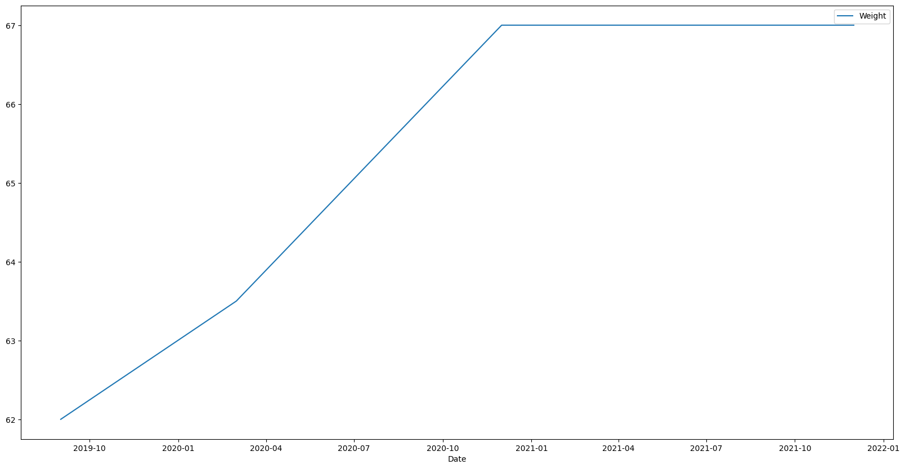
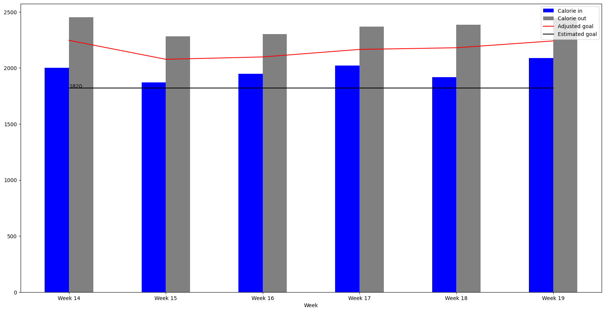
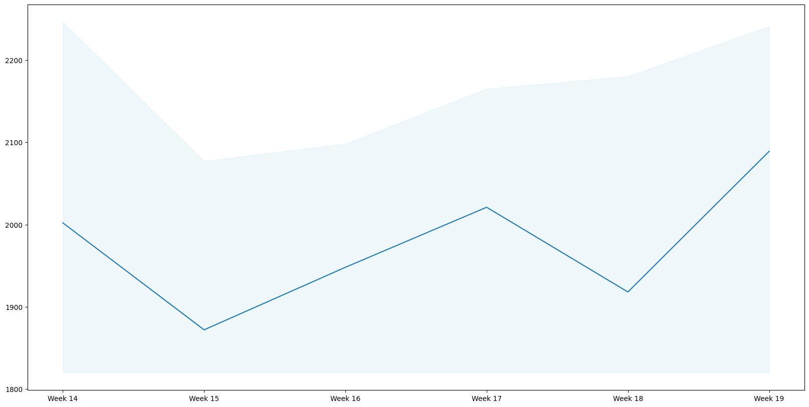
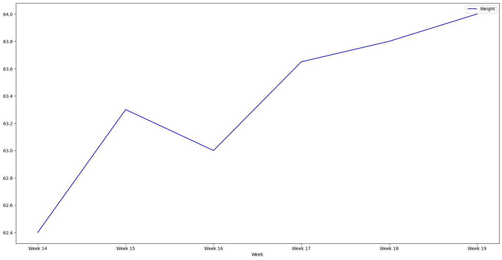

# Nutrition follow up

April 2022 - 3 month feedback

---

# Agenda

- À quoi ça sert ?
- Le principe
- Les applications courantes
- Pourquoi j'ai fait ça ?
- Mes objectifs

---

# Le principe

Suivre

- Les calories que l'on mange
- La répartition des macronutriments
  - Protéines
  - Lipides
  - Glucides

---

# Les applications courantes

Beaucoup utilisé dans le monde de la préparation physique

- Fitness
- Acteurs
- Autres sportifs de haut niveau

Utilisé généralement pour
- Prise de masse
- Sèche

--- 

# Les choses à prendre en compte en plus

- Satiété
  - Max de volume pour un minimum de calories
- Plaisir
  - Manger des choses qu'on aime au quotidien
- Repos
  - La majorité du déstockage des graisses et de la construction de la masse musculaire se font pendant qu'on dort
- L'alcool 
- Type d'activité sportive (en fonction de l'objectif)

--- 

# Pourquoi j'ai fait ça - constat

- Prise de poids entre septembre 2019 et décembre 2020 (+5 kg)
- Pas réussi à perdre du poids en 2021

---

# Pourquoi j'ai fait ça

- Constats
  - Le sport ne suffit pas
  - Pas envie de faire un "régime"

- Objectifs
  - Réduction de masse grasse 10% < X < 15%
      - Estimée entre 15 et 20% => 5% de 67kg = 3.35kg
      - Objectif autour de 62kg (3.35 + 1-2kg d'eau et de muscle)
  - Me sentir mieux dans mon corps
      - À l'aise dans mes habits sans changer de garde-robe
      - Retrouver mes sensations au bloc
  - Mieux comprendre mon alimentation
  - Bonus: Abdos visibles

---

**Le calculateur**

---

# Les premiers ajustements

Deux premières semaines difficiles

- Difficulté de concentration
- Faim (tout le temps !)
- Fatigue / Manque d'énergie

Ce que j'ai changé

- Dormir plus
- Boire plus d'eau
- Doubler le volume de légumes
- Calories "circulaire"
- Ajustement du déficit calorique

---

# Cut phase - Calories in/out

---

# Cut phase - Calories in

---

# Cut phase - Macro

---

# Cut phase - Weight

---

# Stabilization phase - Calories in/out

---

# Stabilization phase - Calories in

---

# Stabilization phase - Macro

---

# Stabilization phase - Weight

---

# Ce que je retiens

1. Energie != Satiété
2. Fromage => bombes caloriques
3. Alcool
   1. Calories vide
4. Protéines

